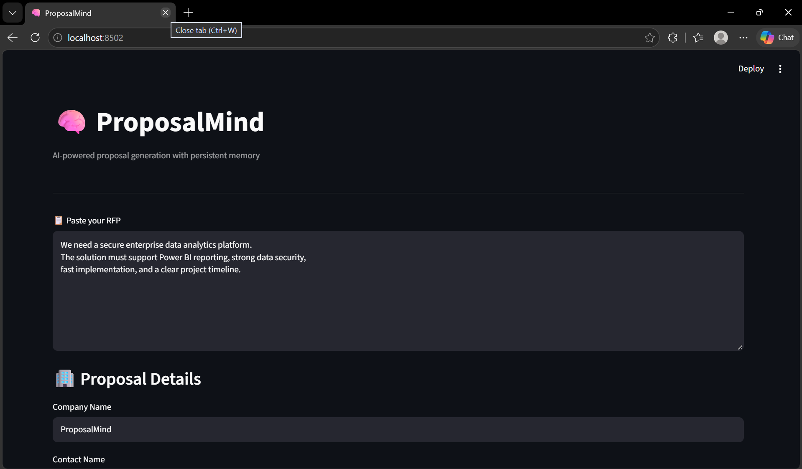
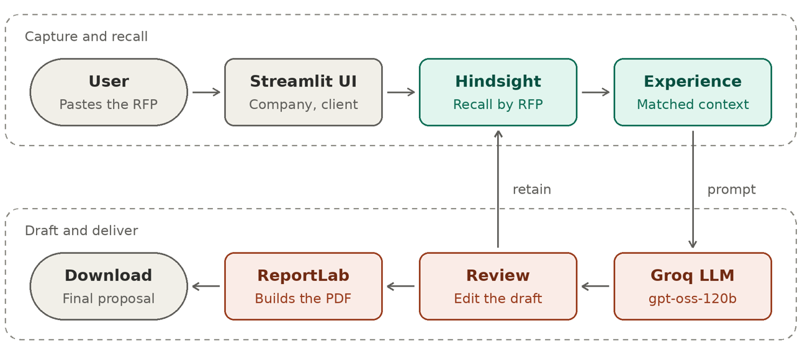
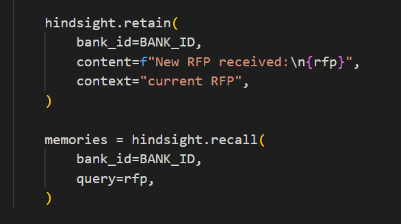
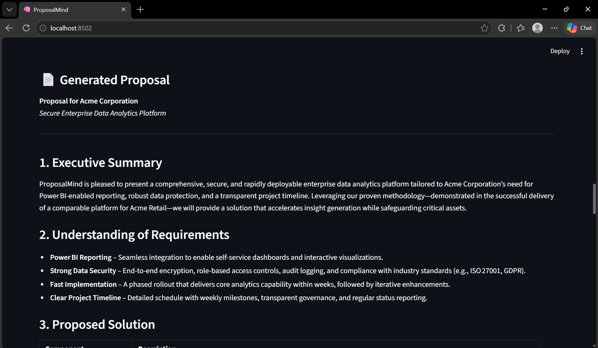
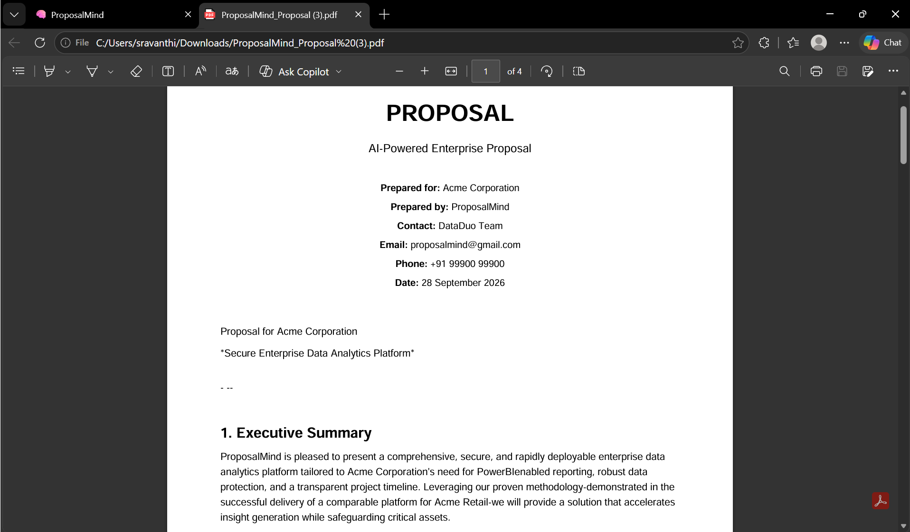
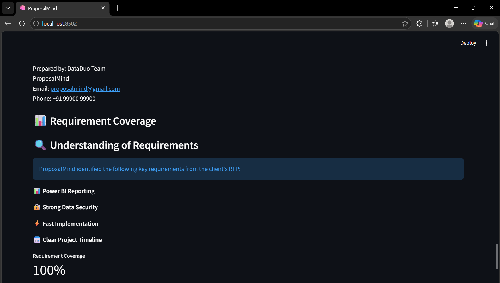
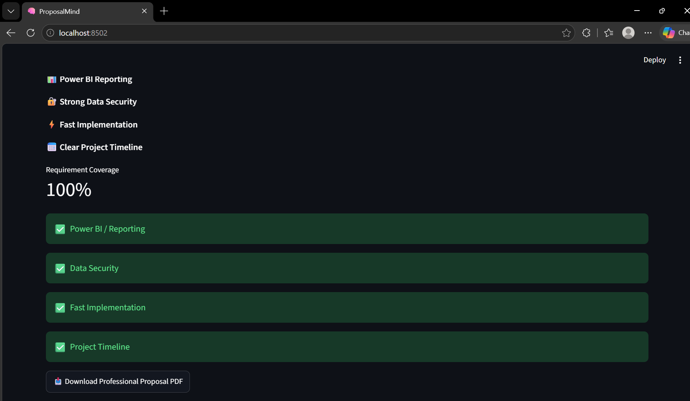

# I Built a Proposal Generator That Remembers Through Hindsight

The first time I wired a language model into proposal writing, the hard part was not getting it to produce polished prose. It was getting it to carry forward the right experience without treating every old proposal as a template. That distinction led me to build the workflow around memory retrieval: retain useful context, recall it against a new request for proposal (RFP), then give the model both the current request and the selected past experience.

## A proposal is more than a prompt

ProposalMind takes an RFP and produces a structured proposal for a named client. The user supplies the RFP and company and contact details in a Streamlit interface. The application stores the request through Hindsight, recalls relevant prior experience, and sends the current requirements plus those memories to a language model through an OpenAI-compatible client pointed at Groq. The result appears in the interface, gets checked against a small set of requirement categories, and can be exported as a formatted PDF using ReportLab.



The repository keeps the flow easy to follow. `ui.py` owns the interactive path: inputs, memory operations, prompt construction, generation, coverage display, and PDF assembly. `app.py` shows the same core idea in a smaller command-line path. Hindsight is configured with a bank identifier and service credentials; the generation client is configured separately. That separation matters: memory retrieval and text generation are different operations with different jobs.

A proposal system has at least two kinds of context. The RFP is authoritative for what this client asked for. Previous work is useful evidence about approaches we have taken before. If those get blended carelessly, the model can carry stale commitments into a new response. I wanted the prompt to make their roles explicit.



## The design choice: remember experience, not just wording

A naive version of this application could paste the last proposal into the prompt. That would be easy, and usually wrong. A past proposal may be long, client-specific, and mostly irrelevant to the request in front of us. It may also encourage copying language where the useful thing was the decision behind it: phased delivery, weekly milestones, or a clear explanation of data protections.

Hindsight gives the application a retain-and-recall boundary. When an RFP arrives, the application retains it with context. It then asks for memories in relation to the current request. The essential calls are small:

```python
hindsight.retain(
    bank_id=BANK_ID,
    content=f"New RFP received:\n{rfp}",
    context="current RFP",
)

memories = hindsight.recall(
    bank_id=BANK_ID,
    query=rfp,
)
```



The first call gives the memory system material to work with beyond the lifetime of the current page interaction. The second avoids assuming that the most recent past proposal is the right precedent. In a real proposal library, a request about analytics security should surface experience that speaks to security and reporting, even if the relevant work was not the last item stored.

That is the reason I made [Hindsight’s persistent memory repository](https://github.com/vectorize-io/hindsight) a core dependency rather than treating memory as a prompt-building trick. The [Hindsight documentation](https://hindsight.vectorize.io/) describes the memory interface and its behavior; the design lesson for this application is straightforward: give the memory layer a retrieval question tied to the work at hand, then make its contribution inspectable.

## Keep the evidence visible

The Streamlit flow renders the recalled result in an expander before it shows the generated proposal. That small choice has an outsized effect on whether the workflow feels trustworthy. An operator can see whether the system recalled something relevant, spot an unrelated memory, and judge the proposal in light of the context it received.

The recalled material is also placed in a clearly labeled section of the generation prompt:

```python
prompt = f"""
NEW RFP:
{rfp}

RELEVANT PAST EXPERIENCE:
{memory_text}

Create the proposal with these sections:
1. Executive Summary
2. Understanding of Requirements
3. Proposed Solution
...
"""
```


This is not a guarantee that a model will reason perfectly about provenance. It is a way to make the intended boundary legible: the new request says what must be answered; prior experience can inform how we answer it. The prompt adds concrete guardrails too. It tells the model not to invent contact information or specific past results absent from the provided material. Those instructions are especially important in a document that can become a business commitment once someone sends it to a client.

I also found it useful to describe memory as a source of reusable decisions, not an oracle. A remembered phased rollout can help shape an implementation section. It does not prove that the same rollout fits a different client, budget, or timeline. The human reviewing the document still needs to decide whether the recalled approach applies.

This distinction is part of the broader idea of [agent memory and how it differs from a prompt](https://vectorize.io/what-is-agent-memory): a prompt is the immediate working context, while memory lets an application carry information between interactions and retrieve it when it becomes relevant. In ProposalMind, the RFP and company details are the working context; Hindsight provides retrieved experience that can inform that context.

## From generation to a reviewable artifact

The model call uses the OpenAI Python client against Groq’s compatible endpoint, so the prompt and response handling stay familiar:

```python
response = groq_client.chat.completions.create(
    model="openai/gpt-oss-120b",
    messages=[{"role": "user", "content": prompt}],
)
proposal = response.choices[0].message.content
```

The generated text is not the end of the workflow. ProposalMind presents it in the UI, runs a basic requirement coverage check, and builds a PDF with client and company details, sections, and page numbers. That last conversion deserves attention: a proposal that reads well in a browser can still be awkward when exported. The PDF path translates headings and paragraphs into ReportLab flowables and applies page-level numbering.



The coverage display compares the generated text against terms associated with categories such as reporting, security, implementation speed, and timeline. This is a deliberately understandable signal. If a proposal omits “Power BI” or “timeline,” a reviewer gets a prompt to inspect it. A keyword match is not semantic proof of coverage, and a high percentage is not an acceptance test. I would keep that distinction visible in any production interface; otherwise a convenient indicator can acquire more authority than its method deserves.




## The design choice: remember experience, not just wording

Consider an RFP asking for secure analytics, Power BI reporting, and a phased rollout. If the memory bank contains prior experience describing access controls, weekly milestones, and dashboard integration, recall can bring that experience into the proposal context. The generated response can then discuss a phased implementation and explain security in terms grounded in prior work, while the coverage panel points out whether its text mentions the requested categories. The useful behavior is not that the model repeats the old proposal. It is that it can reuse relevant reasoning while responding to a different request.

## What I learned

**Memory quality starts at retention.** Retrieval cannot rescue vague or misleading records. Store context that explains what an item represents and, where appropriate, what was actually learned from it. A raw RFP and a validated delivery outcome are different kinds of memory; treating them as interchangeable invites bad precedent.

**Ask a question that reflects the current task.** A broad “find useful things” query gives retrieval little direction. Passing the RFP as the query ties recall to the actual requirements. For larger systems, I would make that query explicit and structured around the decision being made, while preserving the original request as source material.

**Show what influenced the output.** Rendering recalled memories gives the operator a way to catch mismatch before reading the whole proposal. Visibility does not eliminate errors, but it makes the system easier to inspect and correct.

**Keep checks honest about what they measure.** Keyword coverage is a useful reminder, not a semantic evaluator. It can tell me that a phrase appeared; it cannot establish that the proposal answered the requirement well. More serious review needs requirement-level evidence and a human decision.

**Separate current facts from reusable experience.** The model should know which facts belong to this client and which came from earlier work. Clear prompt sections and explicit no-invention instructions help, but the application should also preserve provenance as the system grows.

ProposalMind began as a straightforward workflow: accept an RFP, retrieve relevant experience with Hindsight, generate a response, and make it easy to review and export. The part I care about most is the boundary between memory and generation. A model can write a coherent proposal from a blank prompt. A useful proposal assistant needs to find the right prior experience, show where that experience came from, and leave the final judgment with the person responsible for sending the document.
